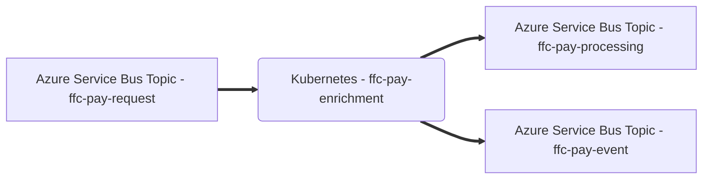

# Pay Enrichment 

Microservice to enrich payment requests with mandatory data.

This service is part of the [Strategic Payment Service](https://github.com/DEFRA/ffc-pay-core).



## Prerequisites

- [Azure Service Bus](https://docs.microsoft.com/en-us/azure/service-bus-messaging/)
- [Docker](https://www.docker.com/)
- Either:
  - [Docker Compose](https://docs.docker.com/compose/install/linux/#install-the-plugin-manually)
  - [Docker-Compose (standalone)](https://docs.docker.com/compose/install/other/)

Optional:
- [Kubernetes](https://kubernetes.io/)
- [Helm](https://helm.sh/)

### Configuration

#### Azure Service Bus

This service publishes responses as messages to Azure Service Bus topics.

| Name | Description |
| ---| --- |
| `MESSAGE_QUEUE_HOST` | Azure Service Bus hostname, e.g. `myservicebus.servicebus.windows.net` |
| `MESSAGE_QUEUE_USER` | Azure Service Bus SAS policy name, e.g. `RootManageSharedAccessKey`    |
| `MESSAGE_QUEUE_PASSWORD` | Azure Service Bus SAS policy key |
| `MESSAGE_QUEUE_SUFFIX` | Developer initials, optional, will be |automatically added to topic names, e.g. `-jw `|
| `PAYMENT_TOPIC_ADDRESS` | Azure Service Bus topic name for payment messages, e.g. `ffc-pay-request` |
| `PROCESSING_TOPIC_ADDRESS` | Azure Service Bus topic name for processing messages, e.g. `ffc-pay-processing`
| `EVENT_TOPIC_ADDRESS` | Azure Service Bus topic name for event messages, e.g. `ffc-pay-event` |

##### Message schemas

All message schemas are fully documented in an [AsyncAPI specification](docs/asyncapi.yaml).

## Setup

### Configuration

These configuration values should be set in the [docker-compose.yaml](docker-compose.yaml) file or Helm [values file](helm/ffc-pay-responses/values.yaml) if running Kubernetes.

| Name | Description |
| ---| --- |
| `APPINSIGHTS_CLOUDROLE` | Azure App Insights cloud role |
| `APPINSIGHTS_INSTRUMENTATIONKEY` | Azure App Insights instrumentation key |

#### Docker

Docker Compose can be used to build the container image.

```
docker-compose build
```

The service will file watch application and test files so no need to rebuild the container unless a change to an npm package is made.

## How to start the service

The service can be run using the [start](scripts/start) script.
```
./scripts/start
```

This script accepts any Docker Compose [Up](https://docs.docker.com/engine/reference/commandline/compose_up/) argument.

### Debugging

A debugger can be attached to the running application using port `9241`.

## How to get an output

There are 2 different possible outputs:

1. **Enrich a valid payment request**
**Input**: Submit a [payment request](./docs/asyncapi.yaml) onto the `PAYMENT_TOPIC_ADDRESS` Topic.
**Output**: An [enrichment payment request](./docs//asyncapi.yaml) is put onto the `PROCESSING_TOPIC_ADDRESS` Topic and an [successful event](./docs/asyncapi.yaml) is put onto the `EVENT_TOPIC_ADDRESS`
2. **Enrich an invalid payment request**
**Input**: Submit an invalid payment request missing a required field or an invalid value onto the `PAYMENT_TOPIC_ADDRESS` Topic.
**Output**: An [unsuccessful event](./docs/asyncapi.yaml) is put onto the `EVENT_TOPIC_ADDRESS` and the message is dead lettered.

## How to stop the service

The service can be stopped using the [stop](scripts/stop) script.
```
./scripts/stop
```

The script accepts any Docker Compose [Down](https://docs.docker.com/engine/reference/commandline/compose_down/) argument.

For example, to stop the service and clear all data volumes.
```
./scripts/stop -v
```

## How to test the service

The service can be tested using the [test](scripts/test) script.
```
./scripts/test
```

The script accepts the following arguments:

- `--watch/-w` - run tests with file watching to support Test Driven Development scenarios (TDD)
- `--debug/-d` - run tests in debug mode. Same as watch mode but will wait for a debugger to be attached before running tests.

## CI pipeline

This service uses the [FFC CI pipeline](https://github.com/DEFRA/ffc-jenkins-pipeline-library)

## Licence

THIS INFORMATION IS LICENSED UNDER THE CONDITIONS OF THE OPEN GOVERNMENT LICENCE found at:

<http://www.nationalarchives.gov.uk/doc/open-government-licence/version/3>

The following attribution statement MUST be cited in your products and applications when using this information.

> Contains public sector information licensed under the Open Government license v3

### About the licence

The Open Government Licence (OGL) was developed by the Controller of Her Majesty's Stationery Office (HMSO) to enable information providers in the public sector to license the use and re-use of their information under a common open licence.

It is designed to encourage use and re-use of information freely and flexibly, with only a few conditions.
